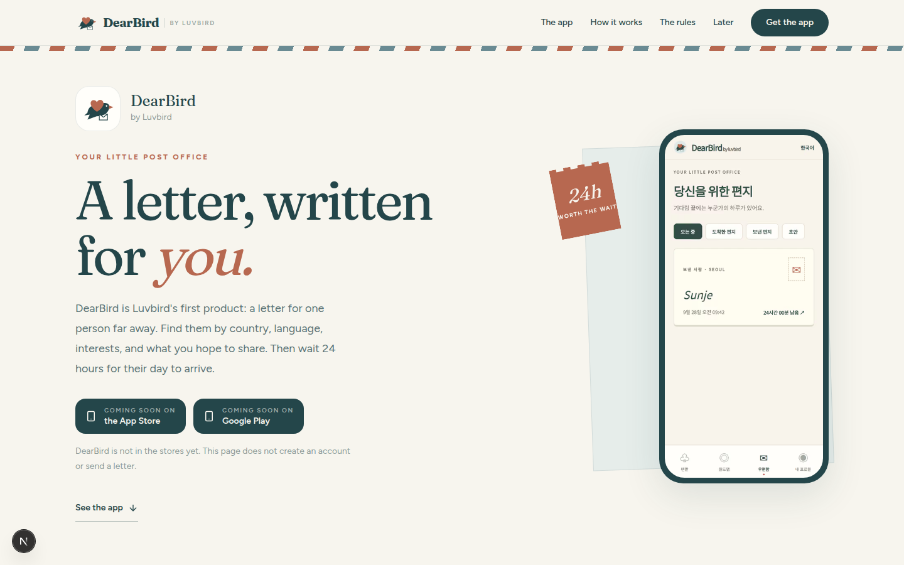
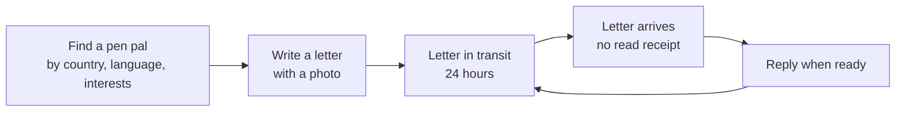
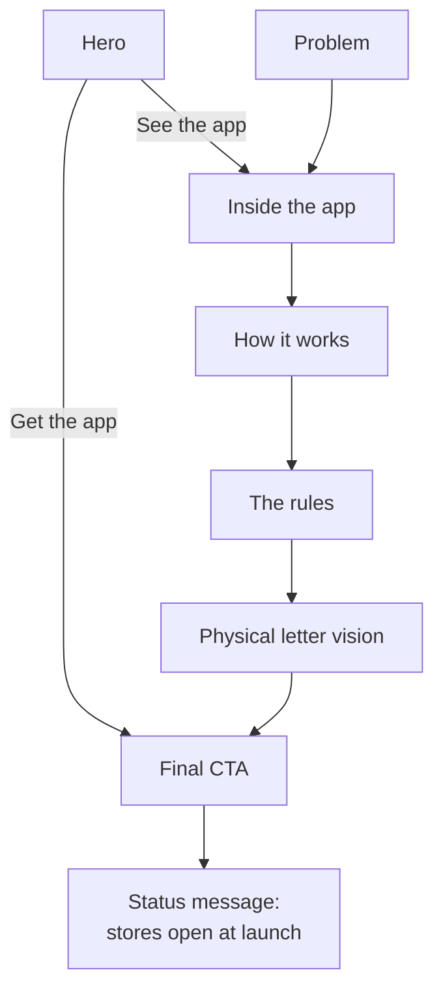
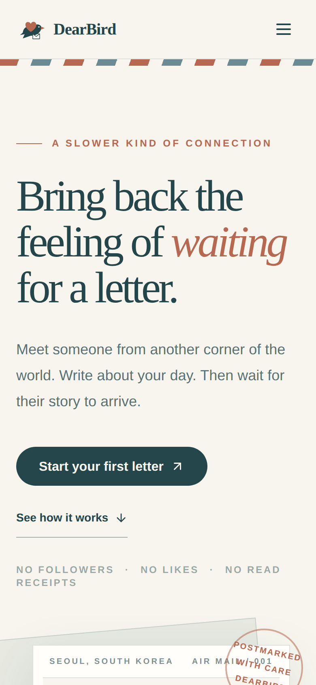
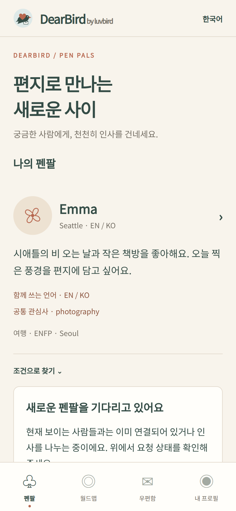
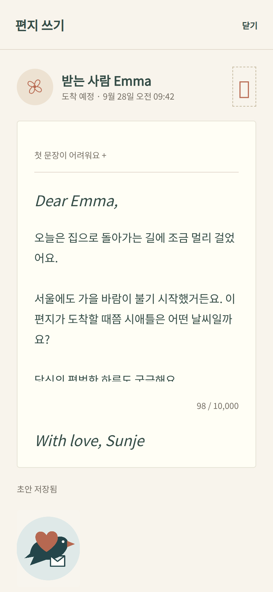
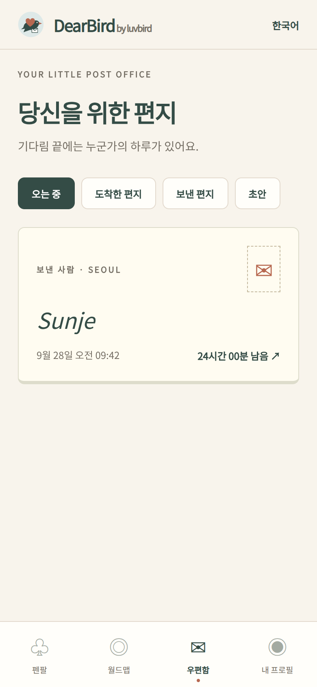
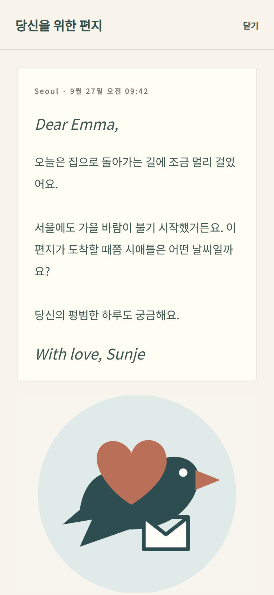

<p align="center">
  
</p>

<p align="center">
  
</p>

<p align="center">
  <strong>DearBird by Luvbird</strong>: a global pen pal product that brings back the feeling of waiting for a letter.
</p>

<p align="center">
  <a href="https://www.luvbird.app/">luvbird.app</a> ·
  Next.js 15 · React 19 · TypeScript · Tailwind CSS
</p>

---

## Overview

Luvbird is the company. DearBird is its first product: a global letter, not a messenger. People find someone by country, language, interests, and why they want to write, then send a photo and a piece of their day. The letter travels for 24 hours, and the other person replies when they are ready.

This repository contains the **DearBird marketing landing page**. It explains the product, shows real screens from the DearBird app, and separates what the product does today from its future physical-mail vision. It does not contain the app's source code, and it does not create accounts or send letters.

- **Live product site:** [https://www.luvbird.app/](https://www.luvbird.app/)
- **This repository:** the DearBird landing page (Next.js, static build)



## Problem

Messaging became instant. Read receipts, endless feeds, and disposable conversations make communication efficient, but they also make it shallow. The small anticipation of opening a letter from far away has almost disappeared.

People aged 18–35 who want international friends, language exchange, or cultural discovery mostly have two options: fast chat apps or social feeds built around followers and likes. Neither encourages slow, considered conversation with one person.

## Solution

DearBird treats waiting as part of the experience rather than a delay to remove.

- Each letter takes **24 hours** to arrive.
- There are **no read receipts**, so nobody feels pressure to reply instantly.
- Profiles show the **city, not the precise location**.
- A letter can carry **a photo and words meant for one person**.
- There are no followers and no likes. The product centers on people and their stories, not engagement.

The landing page's job is to communicate this philosophy clearly and honestly to first-time visitors.

## Core Features

The landing page (`app/page.tsx`) is composed of small section components in `components/`.

| Section | What it does |
| --- | --- |
| Navbar | Sticky header with anchor links and a mobile hamburger menu (`aria-expanded`, `aria-controls`). |
| Hero | App-listing header, store buttons, and the real mailbox screen inside a phone frame. A "24h" stamp moves subtly on scroll. |
| Problem | Frames why a slow letter app exists: instant messages, read receipts, endless feeds, disposable conversations. |
| Inside the app | Switches among four real screens: pen pals, write, mailbox, open letter. Lists the four places in the app. |
| How it works | Three steps in the app: Find, Write, Wait. |
| The rules | Four limits that stay at launch: 24 hours, no read receipts, city-level location, one letter to one person. |
| Physical letter vision | Clearly labeled as "A future chapter": paper mail is not part of the app launch. |
| Final CTA | App Store and Google Play buttons that say the app is coming soon. They do not collect data or open a store listing. |
| Footer | Brand mark and section links. Privacy, Terms, and Contact are placeholders and are not linked yet. |

Implementation details:

- Smooth anchor scrolling with a scroll offset for the sticky header. Smooth scrolling and the stamp motion are both disabled when the user prefers reduced motion.
- Semantic sections, descriptive image alt text, visible focus states.
- Page metadata and an OpenGraph image generated at build time (`app/opengraph-image.tsx`).
- Fully static output: no backend, no database, no environment secrets.

## User Flow

The product flow that the landing page communicates:



How a visitor moves through the landing page:



## Tech Stack

| Area | Choice |
| --- | --- |
| Framework | Next.js 15 (App Router), React 19 |
| Language | TypeScript |
| Styling | Tailwind CSS 3, custom airmail tokens (paper, ink, coral, sky, envelope) |
| UI primitive | shadcn/ui-style `Button` (Radix Slot + class-variance-authority) |
| Icons | lucide-react |
| Images | `next/image` with real app screenshots in `public/screens/` |

## Product Decisions

- **Waiting is the feature.** The 24-hour delay is the core value, so it appears in the hero, a dedicated stamp, the features list, and the "Wait" step.
- **No read receipts, city-level location only.** These choices reduce reply pressure and protect privacy, and the page states them explicitly.
- **Honest CTA.** The CTA never implies signup, letter delivery, or physical mail. Clicking it shows a "preparing for launch" message instead of a fake form.
- **Current features vs. vision.** Physical mail is labeled as a future chapter so visitors don't mistake it for a shipped feature.
- **Real screens over mockups.** The product preview uses actual DearBird app screenshots rather than illustrated placeholders.
- **Design direction.** Vintage airmail motifs (envelopes, stamps, postmarks) with a modern editorial layout. The design deliberately avoids the generic AI-SaaS look: no heavy gradients, no glassmorphism, no dashboard layout.
- **Accessibility as a default.** Reduced-motion support, keyboard-visible focus, labeled navigation, and an accessible mobile menu.

## My Role

**Founder / Product Lead**

- Product planning: defined DearBird's concept, target audience, and product philosophy.
- UX: structured the landing narrative from problem, to principles, to flow, to real screens, to vision, to CTA.
- MVP scope: kept the page to what is true today and moved physical mail into a clearly marked vision section.
- AI-assisted development: built the page with an AI coding assistant, guided by a written product brief ([`CLAUDE.md`](CLAUDE.md)) that sets product rules, design principles, and delivery checks.
- Deployment: prepared the project for Vercel deployment (`NEXT_PUBLIC_SITE_URL` for canonical and OpenGraph URLs).

## Collaboration

- The landing page was implemented through AI-assisted development. [`CLAUDE.md`](CLAUDE.md) is the working brief that defines the service, audience, design principles, and non-negotiable rules (for example, "Do not imply account signup, letter delivery, or physical mail works from this landing page").
- The product screens in `public/screens/` come from the existing DearBird app. This repository does not include the app's source code.

## Current Status

- The landing page is complete. `npm run typecheck` and `npm run build` pass, and every route is prerendered as static content.
- The CTA is a launch placeholder. There is no signup, waitlist, or backend in this repository.
- Footer Privacy, Terms, and Contact entries are placeholders.
- Physical mail is a future vision, not a shipped feature.
- [luvbird.app](https://www.luvbird.app/) is Luvbird's live product site. This landing page is a separate codebase and is not the site served at that domain.

## Screenshots

**Landing page**

| Desktop | Mobile |
| --- | --- |
|  |  |

**DearBird app screens used on the page**

| Discover | Write | In transit | Receive |
| --- | --- | --- | --- |
|  |  |  |  |

## Run locally

Requires Node.js 20 or newer.

```bash
npm install
npm run dev
```

Open [http://localhost:3000](http://localhost:3000).

Verify the production build:

```bash
npm run typecheck
npm run build
```

Optional: copy `.env.example` to `.env.local` and set `NEXT_PUBLIC_SITE_URL` to the deployed HTTPS origin so canonical and OpenGraph URLs point to it.
